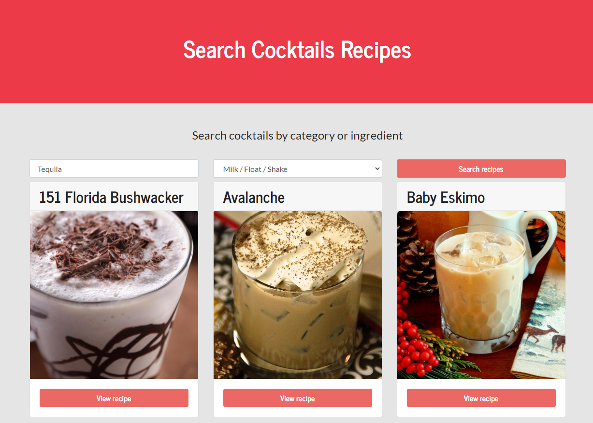

  <h1> 🍹   Cocktails Recipes React App   🍸 </h1>
  
React app to get cocktails recipes

    
  
   
   
  
Final result

  
<strong>https://david-portilla.github.io/cocktails/</strong>

   

## Features

- [x] API rest
- [x] React hooks
- [x] Use context
- [x] Material UI modal

# Weather App

React app to get cocktails recipes using The Cocktail DB API
https://www.thecocktaildb.com/

## Instructions

Type your ingredient and select a category from the list.

## Available Scripts

In the project directory, you can run:

### `npm start`

Runs the app in the development mode.\
Open [http://localhost:3000](http://localhost:3000) to view it in the browser.

The page will reload if you make edits.\
You will also see any lint errors in the console.
